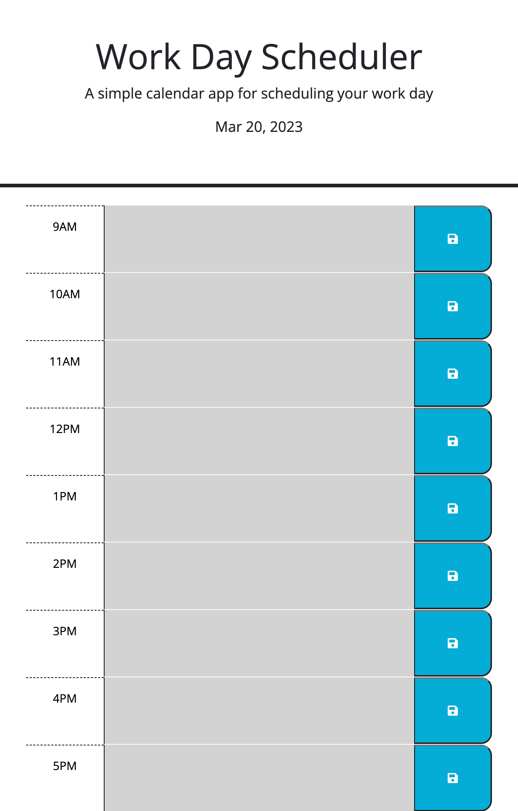

# Work-Scheduler-App

## Description

The purpose of this application was to allow the user to input daily activities and be able to have their inputs saved for past,present, and future.

## Usage 

When the user first opens the  planner application they are presented with the current day and date at the top of the calendar and a empty planner ready for input. 

once the user scrolls down they are presented with time blocks that is colored based on past, present, and future time stamps.

Next the user will enter text into the blocks and then click the blue button to save their content. 

Once the page is refreshed the user can see that the text they entered presist.

https://t-hash-ux.github.io/Worker-Scheduler-App/

## Credits

- Matthew Lomard
- Sarah Miller

## License
MIT License